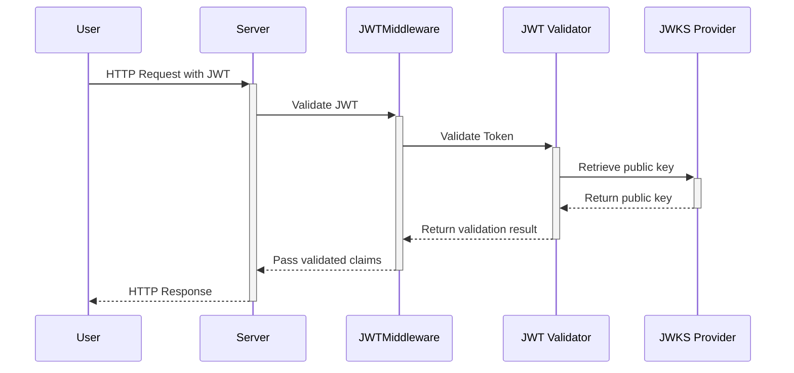

We are using the \``` jwtmiddleware` `` package to validate `JWTs`. `JWTs` are an open standard (RFC 7519) that define a compact and self-contained way for securely transmitting information between parties as a JSON object. This information can be verified and trusted because it is digitally signed.

## References

- Auth0

- Golang auth0 implementation

## Goals

### Auth0 is a flexible, drop-in solution to add authentication and authorization services to your applications. It provides a universal authentication & authorization platform for web, mobile, and legacy applications. Here are some of the key goals of using Auth0:

1.  **Simplify Authentication and Authorization**: Auth0 simplifies the implementation of authentication and authorization, saving development time and reducing the risk of security flaws.

2.  **Provide Secure Authentication**: Auth0 uses industry standards such as OAuth and OpenID Connect for secure authentication. It helps protect your applications from common security threats like SQL injection, Cross-Site Scripting (XSS), and Cross-Site Request Forgery (CSRF).

3.  **Support for Multiple Authentication Methods**: Auth0 supports a variety of identity providers including Google, Facebook, Twitter, and more, as well as different types of identities like username-password, phone numbers, and email addresses. This provides flexibility and convenience to the end users.

4.  **Customizable User Experience**: Auth0 allows for customization of the login interface to align with your brand's identity.

5.  **Scalability and Performance**: Auth0 is designed to support high-volume identity management while maintaining high performance. It can be used for both small and large user bases.

6.  **Integrate with Existing Systems**: Auth0 can integrate with various systems including LDAP, SAML, legacy databases, APIs, and more. This makes it adaptable to many different organizational needs.

7.  **Single Sign-On (SSO)**: Auth0 provides Single Sign-On capabilities, improving user experience by allowing users to log in once and use multiple applications.

8.  **Multi-factor Authentication (MFA)**: Auth0 supports MFA, an essential security feature that protects against password-related threats.

9.  **Compliance**: Auth0 helps businesses comply with regulations and standards like GDPR, HIPAA, and others, providing necessary features like user consent, data breach notifications, and more.

10. **Insights and Analytics**: Auth0 provides useful insights and analytics about your users, such as login activity, which can help inform business decisions.High level design

<br/>

<!--MERMAID {width:100}-->



<!--MCONTENT {content: "sequenceDiagram<br/>\nUser->>+Server: HTTP Request with JWT<br/>\nServer->>+JWTMiddleware: Validate JWT<br/>\nJWTMiddleware->>+JWT Validator: Validate Token<br/>\nJWT Validator->>+JWKS Provider: Retrieve public key<br/>\nJWKS Provider\\-\\-\\>>-JWT Validator: Return public key<br/>\nJWT Validator\\-\\-\\>>-JWTMiddleware: Return validation result<br/>\nJWTMiddleware\\-\\-\\>>-Server: Pass validated claims<br/>\nServer\\-\\-\\>>-User: HTTP Response<br/>\n<br/>"} --->

<br/>

This diagram represents a sequence of interactions between a user, the server, and the various components of the JWT authentication system. Here's what happens:

1.  The user sends an HTTP request to the server, which includes a JWT.

2.  The server invokes the `JWTMiddleware`<swm-token data-swm-token=":cmd/app/api/index.go:21:2:2:`func JWTMiddleware() gin.HandlerFunc {`"/>, passing in the JWT.

3.  The `JWTMiddleware`<swm-token data-swm-token=":cmd/app/api/index.go:21:2:2:`func JWTMiddleware() gin.HandlerFunc {`"/> passes the JWT to the `JWT Validator`.

4.  The `JWT Validator` requests the public key from the `JWKS Provider`.

5.  The `JWKS` `Provider`<swm-token data-swm-token=":cmd/app/Dto/login_dto.go:51:1:1:`	Provider string `json:&quot;provider,omitempty&quot;``"/> returns the public key to the `JWT Validator`.

6.  The `JWT Validator` uses the public key to validate the JWT, then returns the result to the `JWTMiddleware`<swm-token data-swm-token=":cmd/app/api/index.go:21:2:2:`func JWTMiddleware() gin.HandlerFunc {`"/>.

7.  The `JWTMiddleware`<swm-token data-swm-token=":cmd/app/api/index.go:21:2:2:`func JWTMiddleware() gin.HandlerFunc {`"/> passes the validated claims (or an error) back to the server.

8.  Finally, the server sends an HTTP response back to the user, which will be different depending on whether the JWT was valid or not.

## **Code Breakdown**

### `JWTMiddleware`<swm-token data-swm-token=":cmd/app/api/index.go:21:2:2:`func JWTMiddleware() gin.HandlerFunc {`"/> **Function**

<br/>

The `JWTMiddleware`<swm-token data-swm-token=":cmd/app/api/index.go:21:2:2:`func JWTMiddleware() gin.HandlerFunc {`"/> function is a Gin middleware that authenticates incoming HTTP requests based on JWT tokens. The function checks if the token is valid and if it's not, it aborts the request and sends back a response with a 401 Unauthorized status.

In this function, the JWT is extracted from the request context and cast to `*validator.ValidatedClaims`<swm-token data-swm-token=":cmd/app/api/index.go:20:26:29:`		validatedClaims, ok := c.Request.Context().Value(jwtmiddleware.ContextKey{}).(*validator.ValidatedClaims)`"/>. If this cast fails or the `validatedClaims`<swm-token data-swm-token=":cmd/app/api/index.go:21:8:8:`		if !ok || validatedClaims == nil {`"/> is nil, the function responds with an HTTP 401 Unauthorized status code and an error message, then returns immediately.

<br/>If the JWT is valid, the function sets a "user" value in the Gin context. This value is the Subject claim from the JWT, which usually identifies the user who owns the token. The function then calls c.Next(), allowing the request to proceed to the next middleware or handler in the chain.

<!-- NOTE-swimm-snippet: the lines below link your snippet to Swimm -->

### 📄 cmd/app/api/index.go

```go
18     func JWTMiddleware(db *gorm.DB) gin.HandlerFunc {
19     	return func(c *gin.Context) {
20     		validatedClaims, ok := c.Request.Context().Value(jwtmiddleware.ContextKey{}).(*validator.ValidatedClaims)
21     		if !ok || validatedClaims == nil {
22     			c.AbortWithStatusJSON(http.StatusUnauthorized, gin.H{"error": "Invalid token"})
23     			return
24     		}
25     		//
26     		//if ok && validatedClaims != nil {
27     		//	fmt.Println("Issuer:", validatedClaims.RegisteredClaims.Issuer)
28     		//	fmt.Println("Subject:", validatedClaims.RegisteredClaims.Subject)
29     		//	fmt.Println("Audience:", validatedClaims.RegisteredClaims.Audience)
30     		//	fmt.Println("Expiration Time:", validatedClaims.RegisteredClaims.Expiry)
31     		//	fmt.Println("Not Before Time:", validatedClaims.RegisteredClaims.NotBefore)
32     		//	fmt.Println("Issued At Time:", validatedClaims.RegisteredClaims.IssuedAt)
33     		//}
34
35     		c.Set("user", validatedClaims.RegisteredClaims.Subject)
36     		c.Next()
37     	}
38     }
```

<br/>

JWT Provider and Validator Setup

### **Application Middleware Setup**

The final portion of the code wraps the JWT validator in a middleware function and adds this middleware to the Gin application.

<br/>

This file was generated by Swimm. [Click here to view it in the app](https://app.swimm.io/repos/Z2l0aHViJTNBJTNBcGxhY2lvLWFwaSUzQSUzQUNOQy1UZWNobm9sb2dpZXM=/docs/fr451fpq).
