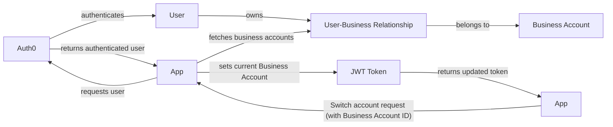

We have multiple business accounts, we'll want to decouple the concept of a "User" from a "Business Account". This is a fairly common pattern in multi-tenant systems.

Here's an example of how we could structure this:

1.  **User**: This will be the user as defined in Auth0, authenticated and managed by Auth0. This corresponds to a real person who will log into your app.

2.  **Business Account**: This is a representation of a business or organization within your application. This would be a new entity in your application's database, separate from the User.

3.  **User-Business Relationship**: This is a relationship between Users and Business Accounts. This would also be a new entity in your application's database. Each record represents a User's membership in a Business Account. This could also include additional metadata about the relationship, such as the User's role within the Business Account (e.g., owner, admin, member).

By separating these concepts, a single User (as managed by Auth0) can be associated with multiple Business Accounts in your app, much like how a single person can manage multiple Pages on Facebook or LinkedIn.

Here's a high-level view of the workflow:

1.  **User Registration/Login**: The user registers/logs in through Auth0 as usual.

2.  **Business Account Creation**: Within your app, the user can create a new Business Account. When this happens, you create a new Business Account in your database and a User-Business Relationship linking the User to the Business Account.

3.  **Business Account Switching**: If a User is associated with multiple Business Accounts, you'll need some way for them to switch between accounts. This could be a dropdown in your app's UI that lists all of the Business Accounts associated with the current User. When the User selects a different Business Account, your app updates the current context to reflect the new Business Account.

4.  **Authorization**: When it comes to authorizing actions (i.e., determining what the User is allowed to do), you'll likely want to base this on their User-Business Relationship rather than the User alone. For example, a User might be an "admin" in one Business Account and a "member" in another.

<br/>

<!--MERMAID {width:100}-->

<!--MCONTENT {content: "graph LR<br/>\nA\\[User\\] -- owns \\-\\-\\> B\\[User-Business Relationship\\]<br/>\nB -- belongs to \\-\\-\\> C\\[Business Account\\]<br/>\nD\\[Auth0\\] -- authenticates \\-\\-\\> A<br/>\nE\\[App\\] -- requests user \\-\\-\\> D<br/>\nD -- returns authenticated user \\-\\-\\> E<br/>\nE -- fetches business accounts \\-\\-\\> B<br/>\nF\\[App\\] -- \"Switch account request (with Business Account ID)\" \\-\\-\\> E<br/>\nE -- sets current Business Account \\-\\-\\> G\\[JWT Token\\]<br/>\nG -- returns updated token \\-\\-\\> F"} --->

<br/>

<br/>

## Getting the sources

Clone the repository locally:

```
git clone https://github.com/my_company/company_repo.git
```

## Build

*   Within the repository directory, run `yarn install` to install the project's dependencies.

*   Then, build the project by running `yarn build`.

Here's what `yarn build` doing behind the scenes:

<br/>


<br/>

### Troubleshooting

```
Error! Cannot execute command (...) "need executable 'ar' to convert dir to deb"(...)
```

*   For electron builder to run, the package `binutils` needs to be installed. Although it should be included when installing electron on the machine/VM - it sometimes fails

*   To avoid build issues, please run `sudo apt-get install binutils` to install this dependency before trying to build the app

## Windows additional steps

## Run the Tests

To run all the tests, run:

```
$ yarn test
```

To run subsets of the tests - you can use `yarn test:<name>`. For example:

```
$ yarn test:server
$ yarn test:utils
```

## Run

### macOS and Linux

```
./scripts/run.sh
```

### Windows

```
 .\scripts\run.bat
```

### Web

```
yarn web
```

## Scripts worth mentioning ⚡️✨

Serve your code with a development web server

```
$ yarn dev
```

Pack for Production. This will generate installers.

```
$ yarn pack
```

See package.json for full list of supported yarn scripts:

<br/>


<br/>

## Debugging

*   Open DevTools by pressing Command+Option+I (Mac) or Control+Shift+I (Windows, Linux). This shortcut opens the Console panel.

*   Click the Sources tab and pick a file from the files navigator.

*   A common method for debugging a problem is to insert a lot of console.log() statements into the code, in order to inspect values as the script executes, but breakpoints can get it done faster.

## Congrats

You now have your dev environment ready 🎉

<br/>

This file was generated by Swimm. [Click here to view it in the app](https://app.swimm.io/repos/Z2l0aHViJTNBJTNBcGxhY2lvLWFwaSUzQSUzQUNOQy1UZWNobm9sb2dpZXM=/docs/tlxl424u).
