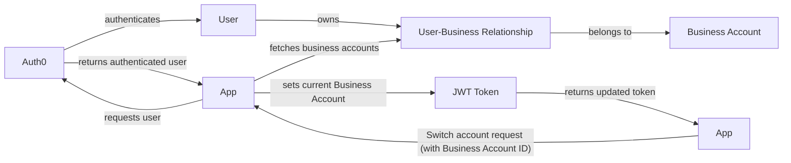

We have multiple business accounts, we'll want to decouple the concept of a "User" from a "Business Account". This is a fairly common pattern in multi-tenant systems.

Here's an example of how we could structure this:

1.  **User**: This will be the user as defined in Auth0, authenticated and managed by Auth0. This corresponds to a real person who will log into your app.

2.  **Business Account**: This is a representation of a business or organization within your application. This would be a new entity in your application's database, separate from the User.

3.  **User-Business Relationship**: This is a relationship between Users and Business Accounts. This would also be a new entity in your application's database. Each record represents a User's membership in a Business Account. This could also include additional metadata about the relationship, such as the User's role within the Business Account (e.g., owner, admin, member).

By separating these concepts, a single User (as managed by Auth0) can be associated with multiple Business Accounts in your app, much like how a single person can manage multiple Pages on Facebook or LinkedIn.

Here's a high-level view of the workflow:

1.  **User Registration/Login**: The user registers/logs in through Auth0 as usual.

2.  **Business Account Creation**: Within your app, the user can create a new Business Account. When this happens, you create a new Business Account in your database and a User-Business Relationship linking the User to the Business Account.

3.  **Business Account Switching**: If a User is associated with multiple Business Accounts, you'll need some way for them to switch between accounts. This could be a dropdown in your app's UI that lists all of the Business Accounts associated with the current User. When the User selects a different Business Account, your app updates the current context to reflect the new Business Account.

4.  **Authorization**: When it comes to authorizing actions (i.e., determining what the User is allowed to do), you'll likely want to base this on their User-Business Relationship rather than the User alone. For example, a User might be an "admin" in one Business Account and a "member" in another.

<br/>

<!--MERMAID {width:100}-->



<!--MCONTENT {content: "graph LR<br/>\nA\\[User\\] -- owns \\-\\-\\> B\\[User-Business Relationship\\]<br/>\nB -- belongs to \\-\\-\\> C\\[Business Account\\]<br/>\nD\\[Auth0\\] -- authenticates \\-\\-\\> A<br/>\nE\\[App\\] -- requests user \\-\\-\\> D<br/>\nD -- returns authenticated user \\-\\-\\> E<br/>\nE -- fetches business accounts \\-\\-\\> B<br/>\nF\\[App\\] -- \"Switch account request (with Business Account ID)\" \\-\\-\\> E<br/>\nE -- sets current Business Account \\-\\-\\> G\\[JWT Token\\]<br/>\nG -- returns updated token \\-\\-\\> F"} --->

<br/>

<br/>

## Models

<br/>

`User` and `BusinessAccount` are many-to-many related through the `UserBusinessAccount` table. Each user can have multiple business accounts and each business account can have multiple users.

<!-- NOTE-swimm-snippet: the lines below link your snippet to Swimm -->

### 📄 cmd/app/models/user.go

```go
6
7      type User struct {
8      	gorm.Model
9      	Auth0ID       string
10     	Relationships []UserBusinessRelationship `gorm:"foreignKey:UserID"`
11     	Settings GeneralSettings `gorm:"foreignKey:UserID"`
12     	Posts []Post `gorm:"foreignKey:UserID"`
13     }
14
15     type BusinessAccount struct {
16     	gorm.Model
17     	Name          string
18     	Relationships []UserBusinessRelationship `gorm:"foreignKey:BusinessAccountID"`
19     	AccountSettings AccountSettings `gorm:"foreignKey:BusinessAccountID"`
20     	Posts []Post `gorm:"foreignKey:BusinessAccountID"`
21     }
22
23     type UserBusinessRelationship struct {
24     	gorm.Model
25     	UserID            uint
26     	User              User
27     	BusinessAccountID uint
28     	BusinessAccount   BusinessAccount
29     	Role              string
30     }
31
```

<br/>

## Services

<br/>

## Contoller

<br/>

This file was generated by Swimm. [Click here to view it in the app](https://app.swimm.io/repos/Z2l0aHViJTNBJTNBcGxhY2lvLWFwaSUzQSUzQUNOQy1UZWNobm9sb2dpZXM=/docs/tlxl424u).
